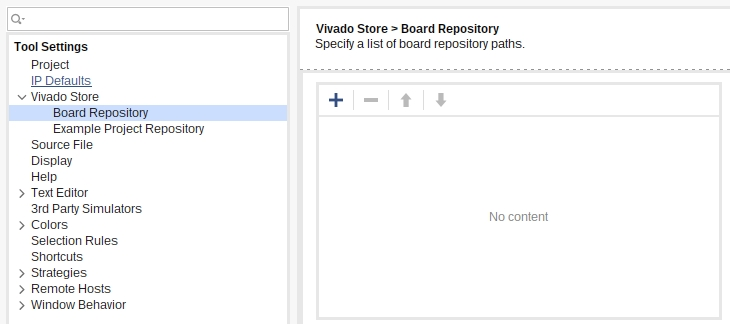

## Adding the board to the Vivado repository

We will prefer `stv0g`'s repository..

Lack of spaces is important! In any **path**, try to ensure absence of **spaces**.

### Preferred method: Through the GUI

* Clone the repo:  $ git clone [https://github.com/stv0g/zturn-stuff.git](https://github.com/stv0g/zturn-stuff)
* Open the `Board Repository` through Tools/Settings/Tool_Settings/Vivado_Store/Board_Repository:

* Add the path to the root of the repository

### (Alternative method: Temporary: Through the [TCL] command line)

## Adding z-turn board to vivado:

### Primary through GUI
### Secondary/(tmp?) through TCL [command line]

* Inform Vivado of a new "board's definitions"'s location:
    * Through the TCL command line:
        * `$ set_param board.repoPaths /path/to/stv0g\'s/zturn-stuff`
            * WARN: Without spaces!
* ### Other boards:
    * $ git clone [https://github.com/Xilinx/XilinxBoardStore.git](https://github.com/Xilinx/XilinxBoardStore/)
    * (TCL command line):
        * `$ set_param board.repoPaths /path/to/XilinxBoardStore`
            * WARN: Without spaces!
* ### Notes:
    * Although these changes are not permanent, a new project defined on a new board, will retain the board configuration/files.

## Reference

* 