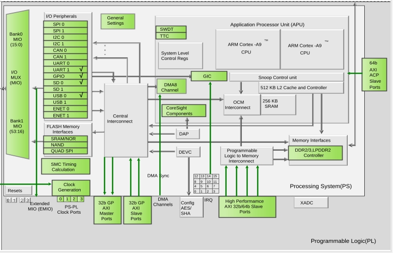
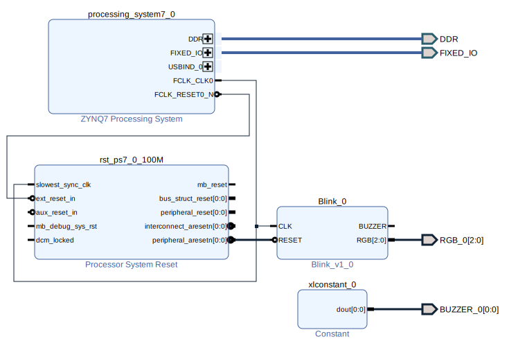
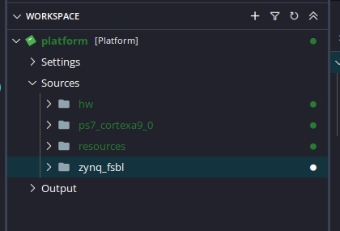
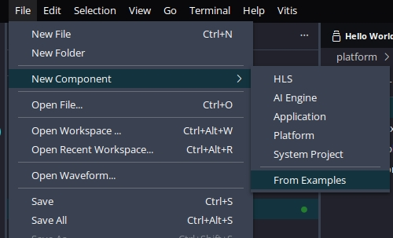
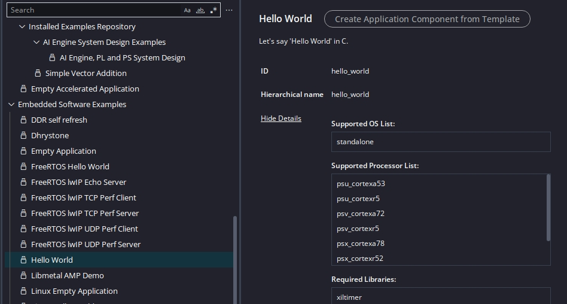
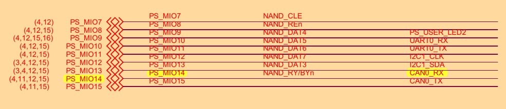
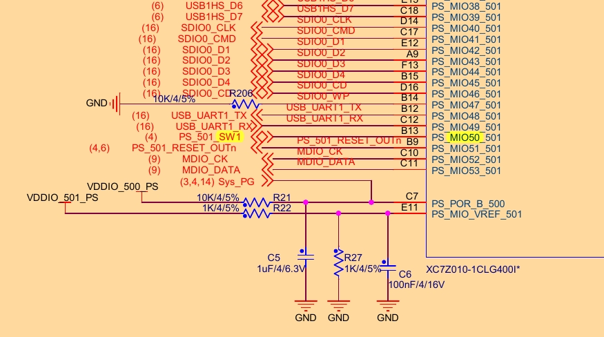
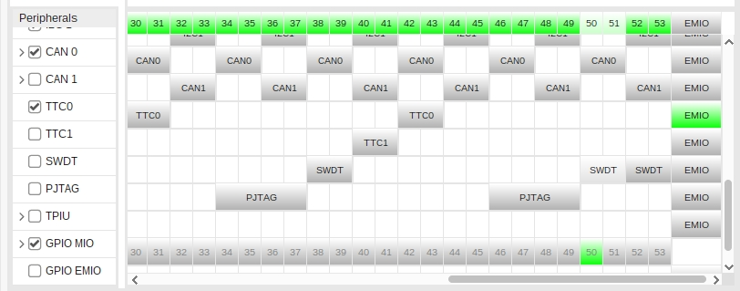
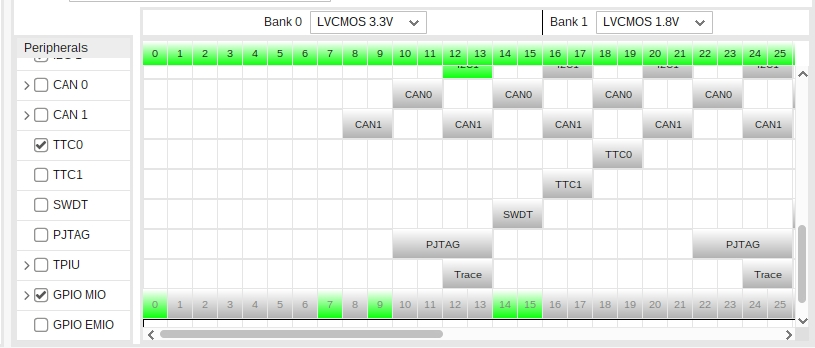
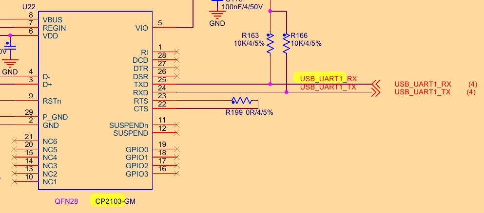

Assuming you understand: [PL only: Standalone](../PL_only:_Standalone/README.md)..

# PS only: Standalone

(As per "[PL only: Standalone](../PL_only:_Standalone/README.md)"), We'll blink:

* ~~CAN: 2 bits~~
* User leds: 1 and 2s
* User Button: (input only)

## We need a similar platform to the [PL only: Standalone](../PL_only:_Standalone/README.md) one, but without disabling all the peripherals. (We probably need UART1 and USB)..

## Let's add a "Hellow World" application. (Not a "Linux Hellow World")!

## Pins:

### ~~CAN: MIO{14,15}~~

### LED: 1,2: MIO{0,9}

### Button: MIO{50}

## Releasing the pins:
## ~~Bound pins: CAN0~~
### Vivado:

### ~~Releasing `CAN0`~~

## [Identifying] USB/UART dependency:

## Phase 2: [Standalone(GPIO)](GPIO.md)

TESting: Changin XSA needs rebuilding BSP?