Assuming you understand: [PL only: Standalone](../PL_only:_Standalone/README.md)..

# PS only: Standalone

(As per "[PL only: Standalone](../PL_only:_Standalone/README.md)"), We'll blink:

* CAN: 2 bits
* User leds: 1 and 2s
* User Button: (input only)

## We will need our exported platform from [PL only: Standalone](../PL_only:_Standalone/README.md)

## Starting Vitis with [our [standalone (OS)] platform]:
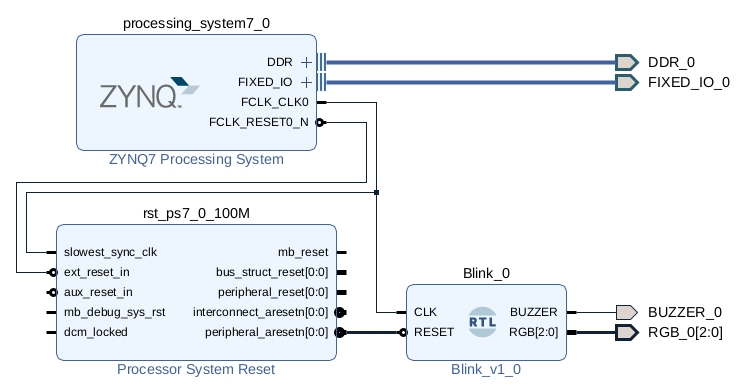

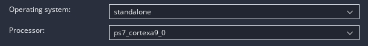

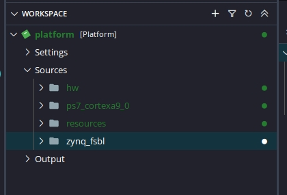

## Let's add a "Hellow World" application. (Not a "Linux Hellow World")!
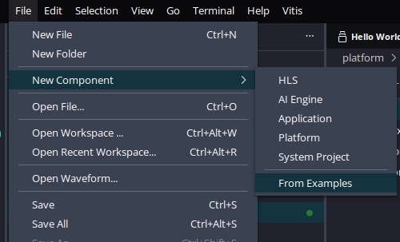

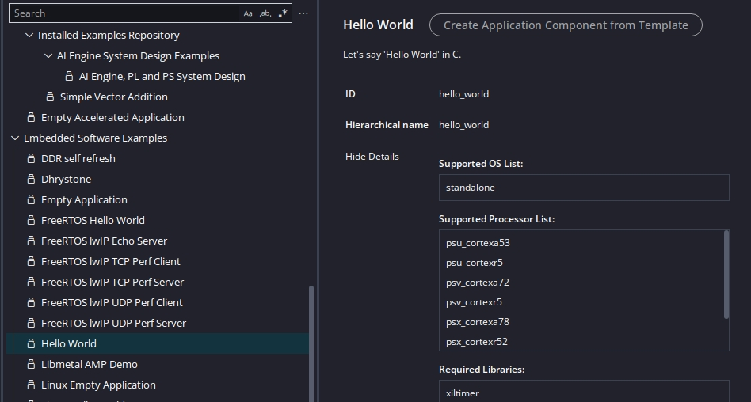

## Pins:

### CAN: MIO{14,15}
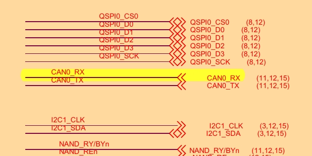

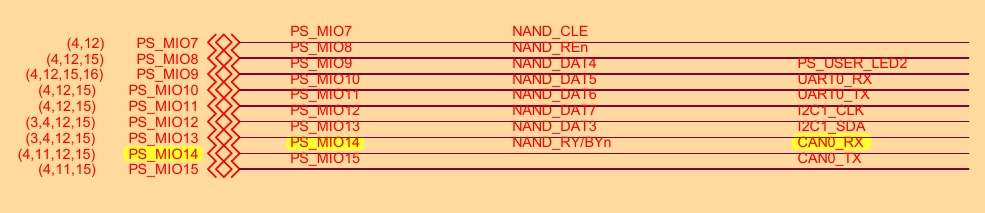

### LED: 1,2: MIO{0,9}

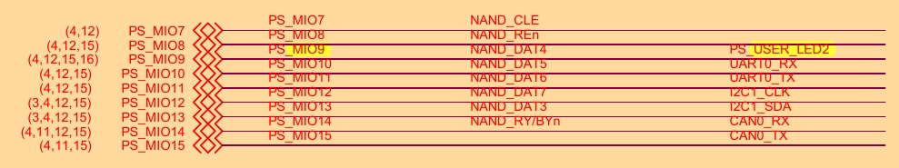

### Button: MIO{50}
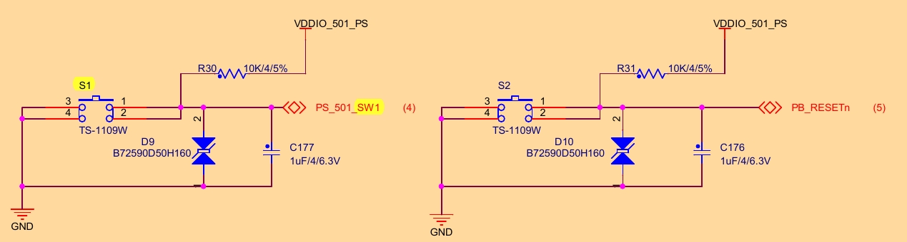

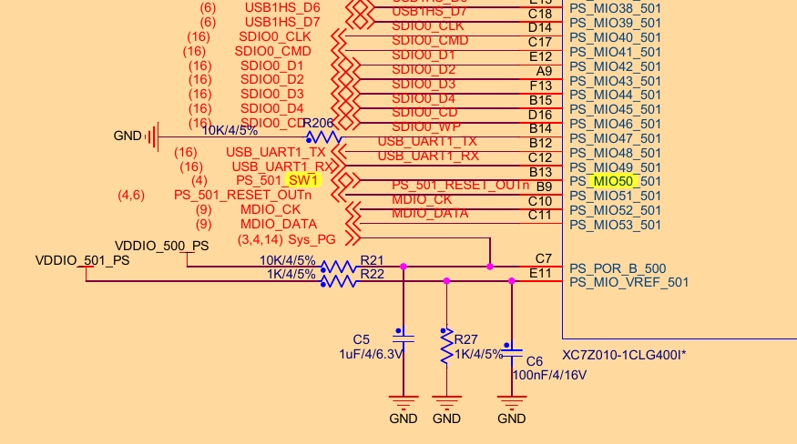

## Releasing the pins:
## Which are [already] bound [to other functions]? (CAN is).
### Vivado:
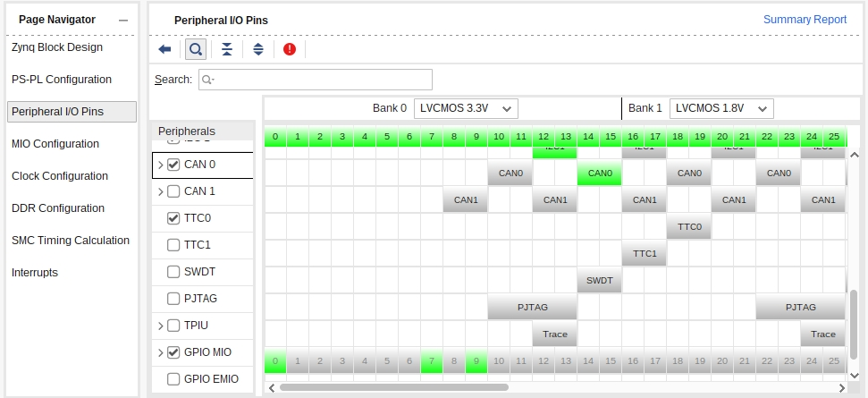

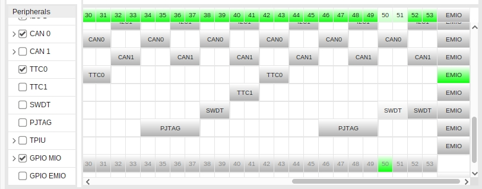
### Releasing `CAN0`

