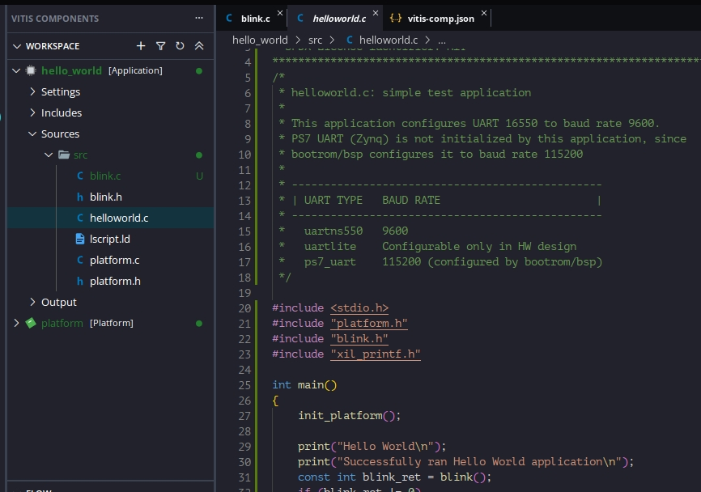

## PL&PS // asynced // polling: Phase 2

## Pin numbers
As per [PL&PS // asynced // polling](README.md), pins are:

* ~~CAN: MIO: 14, 15~~
* [User] LEDs: MIO: 0, 9
* Button: MIO: 50

Summary:

* Output: MIO: 0, 9, ~~14, 15~~
* Input: MIO: 50

## We'll be using the `xgpiops` library (couldn't find documentation 😭)

* There are two methods to read the button: **Polling** and **Interrupt**.
    * Polling is actually probing, while
    * interrupt, releases the cpu from probing (all the time) and pauses the CPU when the button is pressed.
* We'll start with `probing`.

I'll include the `code` first:

## Let's isolate our code: Create new, `blink.*`, files:


### [`blink.h`](blink.h):
```c
// Define a constant to avoid multiple inclusion [of this file].
// -
#ifndef BLINK
#define BLINK

// Blink all(LEDs, CAN, Button(input))
// -
int blink (void);

#endif
```

### [`blink.c`](blink.c):
```c
#include "xparameters.h"
#include "xgpiops.h"
#include <math.h>

#define	XGPIOPS_BASEADDR	XPAR_XGPIOPS_0_BASEADDR

// Blink all(LEDs, CAN, Button(input))
// -
int blink (void)
{
    // --------------------------------------------------------- //
    // -                                                       - //
    // =                 Initialization [area]                 = //
    // -                                                       - //
    // --------------------------------------------------------- //
    XGpioPs Gpio;
	XGpioPs_Config* ConfigPtr = XGpioPs_LookupConfig(XGPIOPS_BASEADDR);
    int Status = XGpioPs_CfgInitialize(&Gpio, ConfigPtr, ConfigPtr->BaseAddr);
	if (Status != XST_SUCCESS) {
		return __LINE__;
	}
    
    // -------------------------------------------------------- //
    // -                                                      - //
    // =                 Configuration [area]                 = //
    // -                                                      - //
    // -------------------------------------------------------- //
    const u32 BUTTON = 50;
    const u32 LED1 = 0;
    const u32 LED2 = 9;
    u32 LED_state = 0;
    // Set output
    // -
    XGpioPs_SetDirectionPin(&Gpio, LED1, 1);
    XGpioPs_SetDirectionPin(&Gpio, LED2, 1);
    XGpioPs_SetOutputEnablePin(&Gpio, LED1, 1);
    XGpioPs_SetOutputEnablePin(&Gpio, LED2, 1);
    // Set input
    // -
    XGpioPs_SetDirectionPin(&Gpio, BUTTON, 0);

    // ---------------------------------------------------- //
    // -                                                  - //
    // =                 Execution [area]                 = //
    // -                                                  - //
    // ---------------------------------------------------- //
    while (1)   // TODO: Interrupt [instead of polling]
    {
        static u32 button;    // Read data

        // Read button
        // -
        button = XGpioPs_ReadPin(&Gpio, BUTTON);

        xil_printf("Button(%d)\n", button);

        // If not paused
        //      Button is inversed. (Probably pull-up(?)).
        //      0: Paused
        //      1: Resumed
        // -
        if (button != 0)
        {
            // Alternante LEDs
            //      LED1 takes the previous value [of LED_state]
            // -
            XGpioPs_WritePin(&Gpio, LED1, LED_state);

            if (LED_state == 0)
            {
                LED_state = 1;
            }
            else
            {
                LED_state = 0;
            }

            // Alternante LEDs
            //      LED2 takes the new value [of LED_state]
            // -
            XGpioPs_WritePin(&Gpio, LED2, LED_state);   // T.N.: Sorry.. I'd prefer `C++`'s: `boolean` 🙃..

            // Delay (for around the same amount as the PL, i.e.: asynchronously).
            // -
            for (int i = 0; i < pow(2, 27 - 1); ++i) // Primitive downscaler to ~ 1Hz // TODO: I'd prefer C++: `constexpr uint32_t freq = pow(2, 27 - 1);`
            {
                // wait //
            }
        }
        else
        {
            // Pause blinking. (Button is pressed). //
        }
    }

    // ---------------------------------------- //
    // =                 Exit                 = //
    // ---------------------------------------- //
    return XST_SUCCESS;
}
```

### [`helloworld.c`](helloworld.c) changes:
```c
#include "blink.h"

const int blink_ret = blink();
if (blink_ret != 0)
{
    xil_printf("ERROR: BLINK(%d)\n", blink_ret);
}
```

## Breaking up the library:

[Although i am not familiar], It seems the general **procedure** is:

```c
#include "xgpiops.h"                                                    // Include header
Status = XGpioPs_CfgInitialize(&Gpio, ConfigPtr, ConfigPtr->BaseAddr);  // Initialize
XGpioPs_SetDirectionPin(&Gpio, LED1, 1);                                // Set direction (0/1: input/output)
XGpioPs_SetOutputEnablePin(&Gpio, LED1, 1);                             // Enable output
button = XGpioPs_ReadPin(&Gpio, BUTTON);                                // Read
XGpioPs_WritePin(&Gpio, LED1, LED_state);                               // Write
```

## References
* [Implementation of GPIO ( i.e., buttons, LED, and Pmod ) via EMIO on ZedBoard](https://youtu.be/CHsidFIXUEE) (*youtube*)
* [xgpiops_polled_example.c](https://github.com/Xilinx/embeddedsw/blob/master/XilinxProcessorIPLib/drivers/gpiops/examples/xgpiops_polled_example.c) (*github*)
* TODO: More!!!