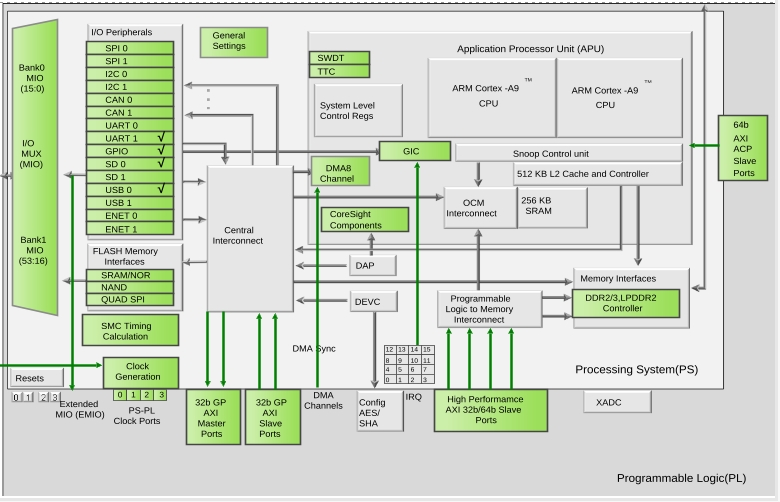

Assuming you understand the previous, [PL](../PL/README.md), part..

"**Standalone**" is the type of OS that will run on the PS. Alteratives are "**FreeRTOS**" and "**Linux**".

# PL&PS // asynced // polling

(As per "[PL](../PL/README.md)"), We'll blink:

* ~~CAN: 2 bits~~
* User leds: 1 and 2s
* User Button: (input only)

## We need a similar platform to the [PL](../PL/README.md) one, but without disabling all the peripherals. (We probably need UART1 and USB)..

## Let's add a "Hellow World" application. (Not a "Linux Hellow World")!

## Pins:

### ~~CAN: MIO{14,15}~~

### Oops: CAN not be 😝!

### LED: 1,2: MIO{0,9}

### Button: MIO{50}

## Releasing the pins:
## ~~Bound pins: CAN0~~
### Vivado:

### ~~Releasing `CAN0`~~

## [Identifying] USB/UART dependency:

## Phase 2: [PS GPIO](GPIO.md)