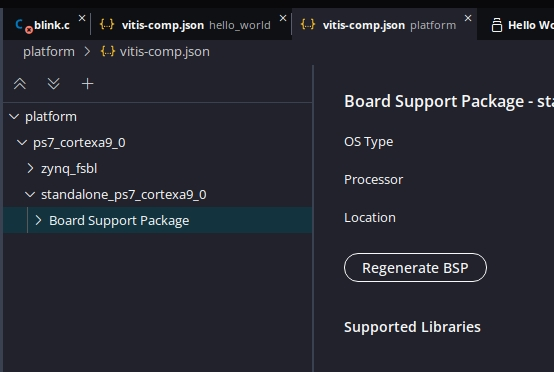

## PL&PS // synced(AXI) // interrupt

### Goal:
* Blink all from PL.
* Pause, with button, from PS.

### More specifically:
* Transfer downsampled clock from PL to PS
* Transfer Button trigger from PS to PL
* Pause PL and PS

### Premature errors
* #### You may need to re-set the platform:

* #### And "Regenerate BSP":

## test

rename to `.cpp`

set mastere AXI

XPAR_XGPIO_1_BASEADDR per diagram

XGpio GpioCLK;
Status = XGpio_Initialize(&GpioCLK, XGPIO_AXI_BASEADDRESS);
XGPIOPS_IRQ_TYPE_EDGE_BOTH
channel 1 in all cases
XGpio_SetDataDirection(&GpioButton, 1, 0);  // 0/1 ~ output/input

bits are '0' in both cases img:[0:0] 

## References:
* [ZYNQ for beginners: programming and connecting the PS and PL | Part 1](https://youtu.be/_odNhKOZjEo) (*youtube*)
* [ZYNQ for beginners: programming and connecting the PS and PL | Part 2](https://youtu.be/AOy5l36DroY) (*youtube*)
* [AXI gpio standalone driver](https://github.com/Xilinx/embeddedsw/tree/master/XilinxProcessorIPLib/drivers/gpio) (*github*)
* [Baremetal Drivers and Libraries](https://xilinx-wiki.atlassian.net/wiki/spaces/A/pages/18841745/Baremetal+Drivers+and+Libraries) (*wiki*)
* [examples](https://github.com/Xilinx/embeddedsw/tree/master/XilinxProcessorIPLib/drivers/gpio/examples) (*github*)
* gpio [API](https://xilinx.github.io/embeddedsw.github.io/gpio/doc/html/api/group__gpio.html) (*API*)
* Error: [Can't find xgpio.h](https://support.xilinx.com/s/question/0D52E00006hpTGBSA2/cant-find-xgpioh-xtmrctrh?language=en_US) (*Xilinx*)
* [`XGpioPs_IntrClear()` examples](https://cpp.hotexamples.com/examples/-/-/XGpioPs_IntrClear/cpp-xgpiops_intrclear-function-examples.html)