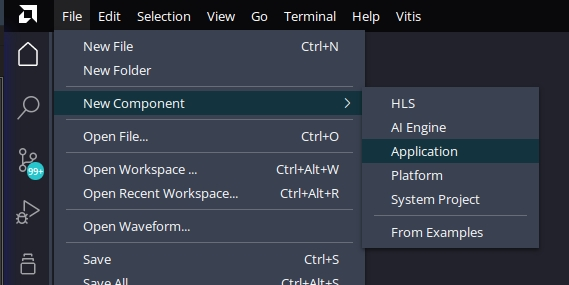

## Blink all [possible].
## Phase 2 [Vitis]

### Outline

* Open workspace.
* Create new platform, from our exported `.xsa` which included the bitstream
    * (Exported is the bootloader also).
    * Use our exported `.xsa` for our new platform.
    * ("Standalone" is fine for our needs).
       * ("Generate Boot artifacts" if there is a choice).
   * Build
* "Create Boot Image"
    * Set `.bif` location
    * Add [[boot] image] partitons
        * Bootloader: It's already been built at step "Build", [probably] due to "Generate Boot Artifacts" option.
        * Bitstream (our vhdl code ;)
* Format an SD card to `FAT32`. And paste, the generated `BOOT.bin`, there.
* (Proper jumpers need to be set, on the "Z-turn board": J1/J2: OPEN/CLOSED).
* (TODO: Check: FAT16?: Boot flag?).

### Steps

#### Open workspace. (I.e., open a folder through vitis, to be used as workspace). --

#### New platform

#### Use [the generated] `.xsa`

#### Standalone (i.e., not linux)

#### Build

#### "Create Boot Image"

#### Set `.bif` location

#### Add partitions

#### Bootloader (FSBL)

#### Bitstream (VHDL)

### Final [state]

## Notes:

After each "platform export" [from vivado], one needs to update the `.xsa` file:

And rebuild..

## [Problems](../../../Problems.md).

## My [`BOOT.bin`](BOOT.bin)