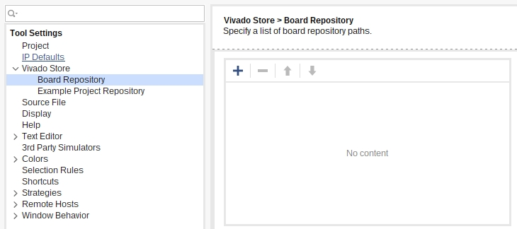

# Z-turn-Board-V2-Diary

* Newbie friendly: VHDL + Vivado.
* [Current] Goal: Linux + FPGA cooperation.

# Adding z-turn board to vivado:

* clone `stv0g`'s repository:
    * $ git clone [https://github.com/stv0g/zturn-stuff.git](https://github.com/stv0g/zturn-stuff)
* Inform Vivado of a new "board's definitions"'s location:
    * Through the TCL command line:
        * `$ set_param board.repoPaths /path/to/stv0g\'s/zturn-stuff`
            * WARN: Without spaces!
* ## Other boards:
    * $ git clone [https://github.com/Xilinx/XilinxBoardStore.git](https://github.com/Xilinx/XilinxBoardStore/)
    * (TCL command line):
        * `$ set_param board.repoPaths /path/to/XilinxBoardStore`
            * WARN: Without spaces!
* ## Notes:
    * Although these changes are not permanent, a new project defined on a new board, will retain the board configuration/files.
    * Alternatively, you can add them [(probably) permanently] through the GUI: 
        * WARN: Without spaces!

# Programming "Hellow World!"

* [Getting started] Video seem to have moved to [FPGA Developer](https://www.youtube.com/watch?v=fVrcUiYxe7M)