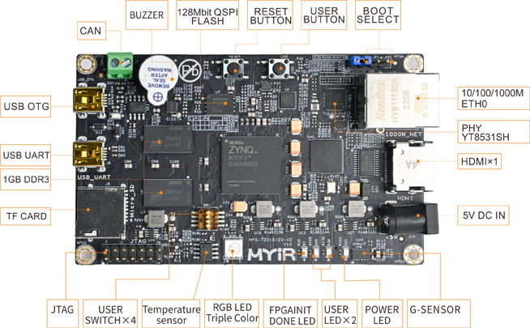

## Z-turn-Board-V2-Diary
[Z-turn](https://www.myirtech.com/list.asp?id=708) is a [cheap] chinese board featuring a [Zynq](https://www.xilinx.com/products/silicon-devices/soc/zynq-7000.html) processor. ([Overview:pdf](https://www.myirtech.com/download/Zynq7000/Z-turnBoardV2.pdf)).

TODO: `.gif`

(Zynqs incorporate both a PL and a PS unit).

(My board has Zynq7020 with a dual core Arm & 80K LUTs (?)).

I'll try to keep the repo, "Beginner Friendly"..

* (Versions): Vitis/Vivado @ 2023.2.2

### Repository goals:
* #### Gotta blink 'em all, Blinkemall!! 🧶🧶
* #### 0: Preliminary:
    * [Boot process](.site/Preliminary/Boot_process/README.md)
    * [Adding the board](.site/Preliminary/Adding_the_board/README.md)
    * [Advanced: Creating a custom module](.site/Preliminary/Module/README.md)
    * [Peripherals: MIO](.site/Preliminary/Peripherals/README.md)
* #### 1: Standalone:
    * [PL](.site/projects/standalone/PL/README.md)
    * [PL&PS // asynced // polling](.site/projects/standalone/PL&PS.asynced/README.md)
    * [PL&PS // asynced // interrupt](.site/projects/standalone/PL&PS.asynced.interrupt/README.md)
    * [PL&PS // synced(AXI) // interrupt](.site/projects/standalone/PL&PS.synced/README.md)
* Goals:
    * #### 3: [PS & PL: Standalone: Independent units](.site/projects/PS_&_PL:_Standalone:_Independent_units/README.md)
    * #### *: [PS & PL: Standalone: PS reads PL](.site/projects/PS_&_PL:_Standalone:_PS_reads_PL/README.md)
    * #### *: [PS & PL: Standalone: PL reads PS](.site/projects/PS_&_PL:_Standalone:_PL_reads_PS/README.md)
    * #### *: [PS & PL: Linux: Independent units](.site/projects/PS_&_PL:_Linux:_Independent_units/README.md)
    * #### *: [PS & PL: Linux: PS Reads PL](.site/projects/PS_&_PL:_Linux:_PS_Reads_PL/README.md)
    * #### *: [PS & PL: Linux: PL Reads PS](.site/projects/PS_&_PL:_Linux:_PL_Reads_PS/README.md)

### ([Various problems and solutions](Problems.md))

### Notes

* IO-planner
* xic: No need to download updates. Run `xic` from [].

### References

* [Getting Started with the MYIR Z-turn](https://www.youtube.com/watch?v=fVrcUiYxe7M) (moved from ?? to FPGA Developer).
* [Z-turn Board Tutorial Book](https://www.myirtech.com/soft.asp?id=969) (don't know how I found that)!
* unsure: https://www.youtube.com/watch?v=FujoiUMhRdQ
* [schematic](https://www.myirtech.com/download/Zynq7000/zturnv2Schematic.pdf) (*pdf*)

### Extra: Tools used:
* OS: Linux([Gentoo](https://www.gentoo.org/))
* Markdown editor: [ReText](https://github.com/retext-project/retext)
* [Vivado] Export [diagram] to `svg`: `$ write_bd_layout -force -format svg -verbose /tmp/design.svg`
* Markdown [syntax](https://docs.github.com/en/get-started/writing-on-github/getting-started-with-writing-and-formatting-on-github/basic-writing-and-formatting-syntax) (*github*)

