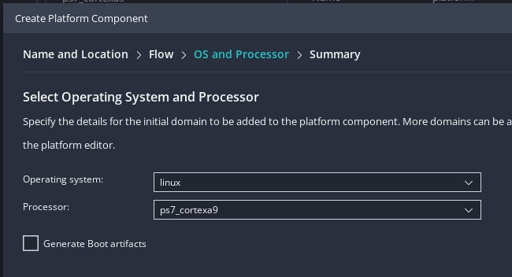
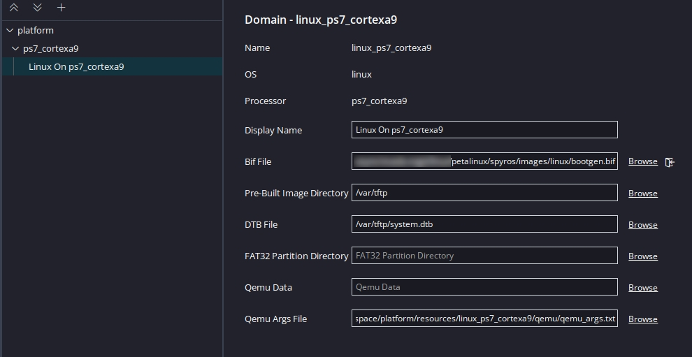
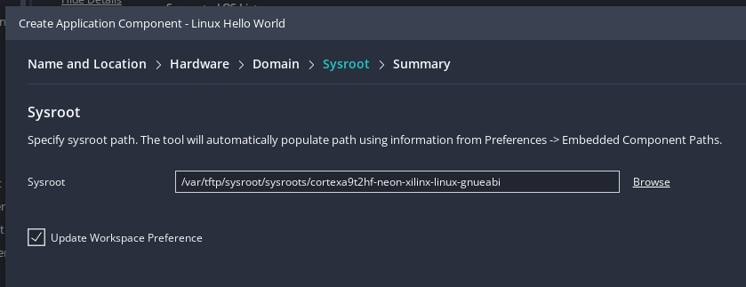

# Linux Hellow World!

## Goal: After PL(Blnking), hellow world from PS(Linux)

---

## Intermediate part: SDK: Providing necessary files to Vitis

In order for Vitis(application) to compile, the necessary **libraries** need to be installed. This can be done from **Petalinux**:

* `$ petalinux-build --sdk`
* `$ petalinux-package --sysroot --dir /path/to/empty/destination/sysroot`  
  (The latter, will populate sysroot with `/lib`)..

---

## Platform

Create a new platform with "linux" as the operating system. (Alternatively, expand an old platform with a "new domain").  
Also, no need for "boot artifacts":

* Link the petalinux `.bif` file, located either at petalinux's: `my_project/images/linux` directory (FIXME: created after config?).
* And the "pre-built image directory" (either `my_project/images/linux` or `tftp/dest`).

### FIXME: Prebuilt fsbl ?: No

* And build [the new platform\]..

---

## Application

Create a new application from templates(Linux Hellow World) (under `File/New Component/From Examples`).  
Set the `sysroot` directory, previously generated through `petalinux`(`--sdk`), to the (inner) `sysroot/sysroots/*-gnueabi` folder:

And build.. Note the generated `.elf` file.

---

## Intrermission: Info(Corrections)

As per the [tutorial]:

* `boot.scr` is the script that U-Boot reads during boot time to load the kernel and rootfs
* `image.ub` contains kernel image, device tree and rootfs

Thus, up until now, the `ext4` (where the `rootfs.tar.gz` was extracted) was not being used 🙊!

### Change to ext4(rootfs)

* enable support

#### Optional(Manually change bootargs):Delete

* copy bootargs
* change boot args
* alternative: append root=

* Enable SD support?

(Petalinux)Flow: Table 7: [Reference][reference](Design Flow Overview)

* export block degign
* enable clocks
* (?deelete prts)?

* initialize
* config:kernel
* build
* package

---

## Troubleshooting

* [Newly created [Linux\]\] Domain [at previous [standalone\] platform\] [is\] not visible: Restarting [Vitis\] worked [for me\]..

---

## Referencies

* [Building and Debugging Linux Applications for Zynq-7000 SoCs](https://xilinx.github.io/Embedded-Design-Tutorials/docs/2023.1/build/html/docs/Introduction/Zynq7000-EDT/4-linux-for-zynq.html) (*site*)
* https://support.xilinx.com/s/article/1141772
* https://docs.amd.com/r/en-US/Vitis-Tutorials-Vitis-Platform-Creation/Add-EXT4-rootfs-support
* https://docs.yoctoproject.org/next/migration-guides/migration-3.4.html

---

[tutorial]: https://xilinx.github.io/Embedded-Design-Tutorials/docs/2023.1/build/html/docs/Introduction/Zynq7000-EDT/4-linux-for-zynq.html "Zynq-7000 Embedded Design Tutorial"
[reference]: https://docs.xilinx.com/r/en-US/ug1144-petalinux-tools-reference-guide/Overview "Petalinux Reference"