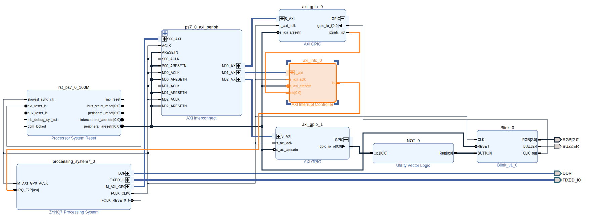

# Assuming [preliminaries](../preliminary/README.md)
# Blinking through Linux

## Vivado part:

* After adding the necessary parts to the `Zynq` component, check for various warnings under 'Platform Setup'
* With respect to PL 2 PS interrupts, add an `AXI Interrupt Controller` between the GPIO_CLK interrupt the the Zynq_IRQ:
    * (Also set the interrupt controller's output, to "single"):

## Petalinux part:

* After **exporting** the relevant **`.xsa`** file from vivado, create a project, configure and build.
* (Include the bitstream(`--fpga`) when packaging(`
$ petalinux-package`), otherwise it may get [**stuck at boot**](#troubleshooting)).  
  FIXME: Sorry: There are, at least two, bitstream locations:
    * `images/linux/system.bit` after (?) `$ petalinux-build`, and
    * **`project-spec/hw-description/design_1_wrapper.bit`** after (?) `$ petalinux-config`.  
    The latter should be fine(updated) for all cases (?).

## Troubleshooting

* Stuck at boot: Include the bitstream through the `--fpga` parameter when packaging(`$ petalinux-package`)  
  By not including the bitstream, apart from the PL not working(blinking), more parts, like the **interrupt controller**, may be inaccessible to the PS:  
  ([Linux\] Boot message): "[`irq-xilinx: /amba_pl@0/interrupt-controller@a0010000: num_irq=1, sw_irq=0, edge=0x0`](https://support.xilinx.com/s/question/0D52E00006hpOdfSAE/axiintc-hangs-on-boot-testcase-on-zcu104)"

## Next: [Vitis: Hellow World](Code.md) under linux