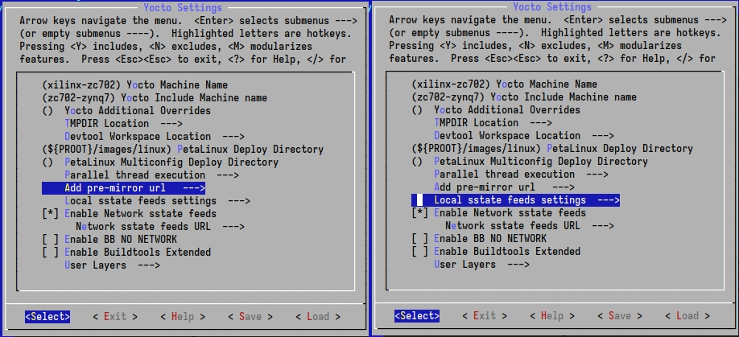
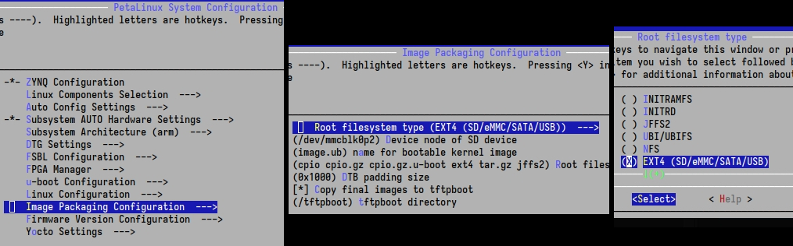
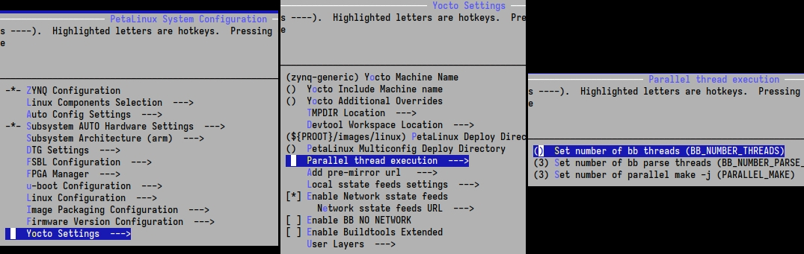
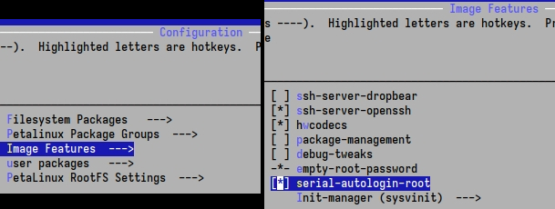

# 🌷 Creating (and compiling) a project 🌌

---

## Outline:

* Create a project
* Do minor assisting configurations
    * (x3).
* Build project
* Retrieve(package) boot files

---

## 🏛️(Create a new project):

We will not be using pre-configured settings. (This would be possible by using a [bsp][petalinux] file).  
(Thus, we will rely on templates).

* Create a new project, [specific to our logic design\]:  
  `$ petalinux-create --type project --template zynq --name my_project`  
  `$ cd my_project`
* Configure according to the logic design:  
  `$ petalinux-config --get-hw-description path/to/exported/design_1_wrapper.xsa --silentconfig`  
  ^ This should be run only once, because it initializes. Any subsequent configurations, should be through `$ petalinux-config` (w/o params).

---

## 🏛️(menuconfig: Cache)

To save **download time**, we can **download** various **caches**. There are **two** of them, the "download" and the "sstate" one. Namely, under the [PetaLinux Tools sstate-cache Artifacts][petalinux], the following can be downloaded:

* "arm sstate-cache", and
* "Downloads"

Extract both of them and note the destination paths like so:

* **downloads_path**: `file:///path/to/downloads/inner/downloads/folder`
* **sstate_path**: `/path/to/sstate/top/arm/folder`  
  ^ (**Absolute paths** may be needed)! (Instead of [relative](https://en.wikipedia.org/wiki/Path_(computing)#Absolute_and_relative_paths) ones).

To set them:

* Open `menuconfig`: `$ petalinux-config`
* copy downloads_path to `Yocto-settings ⟶ Add pre-mirror URL`, and
* sstate_path to `Yocto Settings ⟶ Local sstate feeds settings`:



---

## 🏛️(menuconfig: New partition)

(Instead of loading Linux onto [board's\] RAM (default/image.ub)),  
We will install, **Linux**, directly onto the SD(**ext4**) card.

* Open `menuconfig`: `$ petalinux-config`
* `Image Packaging Configuration ⟶ Root filesystem type ⟶ EXT4`  
  ^ (This will automatically affect other [configuration\] areas).



---

### 🏛️(menuconfig: Extra(threads))

* `Yocto Settings ⟶ Parallel thread execution`  



---

### 🏛️(menuconfig: Extra(auto-login))

(As per [reference]), Open the `rootfs` configuration:  
`$ petalinux-config -c rootfs`

* `Image Features ⟶ serial-autologin-root`  



---

## 🏛️(SD read-write):

In order to not boot read-only, we'll need a `device tree` specification.  
Taken from the original [source code][source], we'll adapt the device tree specifications (files `system-user.dtsi` and `zturn-pl-hdmi.dtsi` (the `.dtsi` stands for `Device Tree Source Include`)), too isolate the SD part: (and adapt the `system-user.dtsi` file):

`my_project/project-spec/meta-user/recipes-bsp/device-tree/files/system-user.dtsi`:

```cpp
/include/ "system-conf.dtsi"
/ {
    aliases {
		mmc0 = &sdhci0;
	};
};

&sdhci0 {
	status = "okay";
	disable-wp;
	// wp-inverted;
};
```

---

## 🏛️(Build the project):

* `$ petalinux-build`  
  ^ (Note: You may wanna save the `build/downloads` folder to reduce download times).

---

## 🏛️(Package the boot images):

FIXME: Why?

* Prepare the boot images, including the bitstream, using:  
  `$ petalinux-package --boot --u-boot --fpga project-spec/hw-description/design_1_wrapper.bit`  
  ^ The important part is (`--fpga path/bit`) to include the bitstream.  
  _ Amongst the errors, are inability to find the interrupt controller ([boot hang](https://support.xilinx.com/s/question/0D52E00006hpOdfSAE/axiintc-hangs-on-boot-testcase-on-zcu104?language=en_US)).  
    Note:
    * `project-spec/hw-description/design_1_wrapper.bit` is updated after `$ petalinux-config`, whereas
    * `images/linux/system.bit` may not be updated
* This will create the:
    * `BOOT.BIN`, `boot.scr`, `image.ub` files which contain the bootloader (?), the (?) [[reference]\] and the kernel, along with:
    * `rootfs.tar.gz`, which will be extracted onto the SD.

---

## Boot:

As per [reference]:

* Copy the `BOOT.bin`, `boot.scr` and `image.ub` files into a `FAT32` partition of the SD card  
  (Preferably, the FAT32 is (at least (?)) 4MiB after the start).
* Extract `rootfs.tar.gz` into an `ext4` partition

(You can monitor the boot process with [picocom](https://github.com/npat-efault/picocom) or [CuteCom](https://gitlab.com/cutecom/cutecom)).

---

## Various troubleshooting from the internet:

* Some fixed by reinstalling petalinux
* [Petalinux 2023.2 known issues](https://support.xilinx.com/s/article/000035572) (*site*)

---

## Referencies

* UG1144: [PetaLinux Tools Documentation: Reference Guide](https://docs.xilinx.com/r/en-US/ug1144-petalinux-tools-reference-guide/Overview) (*site*)
* [The original\] [Source code](https://d.myirtech.com/Z-turn-board/) (*chinese site*)

---

<!-- How can these [anchors\] be made visible? -->

[reference]: https://docs.xilinx.com/r/en-US/ug1144-petalinux-tools-reference-guide/Overview "Petalinux Reference"
[bsp]: https://d.myirtech.com/Z-turn-board/
[petalinux]: https://www.xilinx.com/support/download/index.html/content/xilinx/en/downloadNav/embedded-design-tools.html "Petalinux installer"
[source]: https://d.myirtech.com/Z-turn-board/