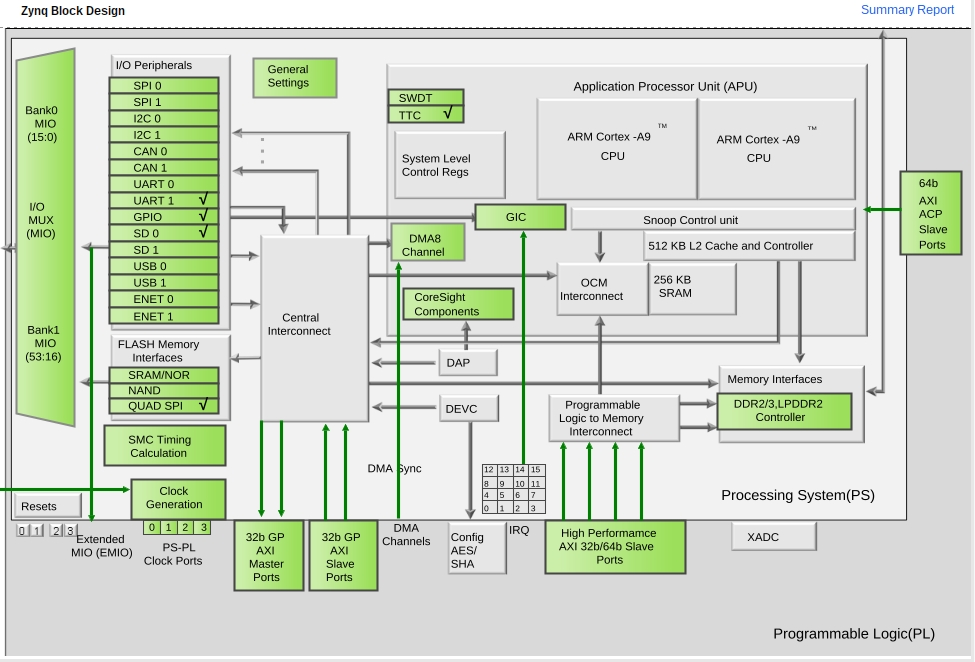
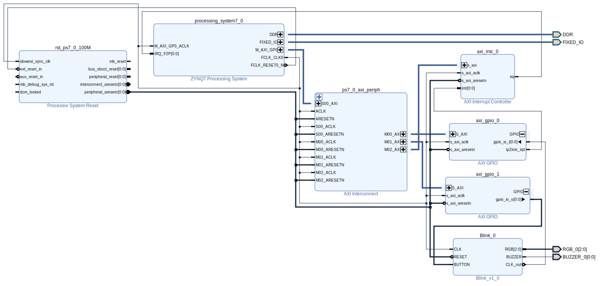

# 🌷Linux(Preliminaries)🌌

Necessary steps for Linux in Zynq.

---

## [Ensuring\] Vivado [output(`.xsa`)\] compatibility

As per [reference], certain processor features must be enabled. Namely:

* "One Triple Timer Counter (**TTC**) (required)".
* "**External memory** controller with at least 512 MB of memory (required)".
* "**UART** for serial console (required)".
* "Non-volatile memory, for example, **QSPI** flash and **SD**/MMC. This memory is optional, but only the JTAG boot can work".
* "**Ethernet** (optional, essential for network access)".

(Simply re-adding the "**Zynq**" component, should be sufficient).  
(Re-export (including bitstream) afterwards).

---

### Example(Block Design):


---

### Example, minimalistic, block diagram:

<!-- $ write_bd_layout -force -format svg -verbose /tmp/block_diagram.svg -->

---

## Petalinux installation

Two things need to be downloaded:

* The [petalinux] installer, and
* the [BSP][petalinux] (Board Support Package) (for the z-turn platform (i.e. for Zynq7000))
    * The proper BSP (ZC702) can be chosen according the respective [ZC702] and [ZC706] pages

(Going one step further), Supposing installation on unsupported OS(Gentoo):  
One method is to `chroot` into a supported one: e.g.: [Ubuntu LTS][Ubuntu], thus regular installation, on a partition, is needed.  
In order to chroot into it, I use the following script:  
```bash
#!/bin/bash
DEST=/path/to/Ubuntu/mountpoint
cd "$DEST"
cp --dereference /etc/resolv.conf etc/
for i in dev sys;
do
        mount --rbind /$i $i
        mount --make-rslave $i
done
# mount --bind /var/tftp tftpboot
# mount --make-rslave tftpboot
mount -t tmpfs none tmp
mount -t proc /proc proc
# #### ######## #### #### ######## #### #
chroot . /bin/bash -l                                                                                                                                                                                                                          
umount -Rl "$DEST"/*
```

---

### Inside the `chroot` jail 🏛️(Preparation):
* `$ source /etc/profile`
* Fix `/bin/sh` to point to `/bin/bash`:  
  `$ dpkg-reconfigure dash`
* Install the necessary packages, either through
    * the [petalinux dependencies script][plnx], or by consulting
    * the [packages list spreadsheet][xlsx]
    * Example command:  
      `$ apt-get install iproute2 gawk python3 build-essential gcc git make net-tools libncurses5-dev tftpd zlib1g-dev libssl-dev flex bison libselinux1 gnupg wget git-core diffstat chrpath socat xterm autoconf libtool tar unzip texinfo zlib1g-dev gcc-multilib automake screen pax gzip cpio python3-pip python3-pexpect xz-utils debianutils iputils-ping python3-git python3-jinja2 libegl1-mesa libsdl1.2-dev pylint libtinfo5`
* (Ensure the proper locale(e.g.: en_US.UTF-8) is set: `$ locale`)
    * (`$ apt install locales`)
    * (`$ dpkg-reconfigure locales` and set a proper(UTF-8) one)

---

### Inside the `chroot` jail 🏛️(Petalinux instalation):

* Normal user: `$ su - my_username`
* `$ ./petalinux-v2023.2-10121855-installer.run --dir path/to/dest/petalinux/ --platform "arm"`  
  (limiting to `arm` may help (?) reduce the size)
* (`$ cd petalinux`)
* `$ source settings.sh`  
  (opens access to commands like: `petalinux-*`)

---

### Inside the `chroot` jail 🏛️(Project configuration):

* Create a new project [for our logic design\]:  
  `$ petalinux-create --type project --source path/to/xilinx-zc702-v2023.2-10140544.bsp --template zynq --name my_project`  
  (`--template` as a failsafe)
* (`$ cd xilinx-zc702-2023.2`)
* Configure according to the logic design:  
  `$ petalinux-config --get-hw-description path/to/exported/design_1_wrapper.xsa --silentconfig`

---

#### Extra 🏛️(Project configuration):
In order to save download time, one can download the caches used. There are two of them, the "download" and the "sstate" one. Namely, under the [PetaLinux Tools sstate-cache Artifacts][petalinux], the following can be downloaded:

* "arm sstate-cache", and
* "Downloads"

Extract both of them and copy the destination paths like so:

* downloads_path: `file:///path/to/downloads/inner/downloads/folder`
* sstate_path: `/path/to/sstate/top/arm/folder`

When in "project configuration", replace the command with  
`$ petalinux-config --get-hw-description path/to/exported/design_1_wrapper.xsa`  
As per the [reference], inside `menuconfig`, set the:

* "Yocto-settings → Add pre-mirror URL" to downloads_path, and the
* "Yocto Settings → Local sstate feeds settings" to sstate_path

(exit, saving the configuration).  
Note: Absolute paths may be preferable.


---

### Inside the `chroot` jail 🏛️(Project building):

* Build the project, using:  
  `$ petalinux-build`
    * (Saving the `build/downloads` folder, might come in handy, when clearing this project, or opening a new one).
* Prepare the boot images, including the bitstream, using:  
  `$ petalinux-package --boot --u-boot --fpga images/linux/system.bit`

---

### Booting

As per [reference], in order to boot from SD card, the following must be copied/extracted (from `images/linux`):

* Copying `BOOT.bin, boot.scr, image.ub` to `FAT32` partition of SD card
* Extracting `rootfs.tar.gz` to `ext4` partition of SD card

---

## Various troubleshooting from the internet:

* Some fixed through reinstalling petalinux
* Do not mix different Petalinux and BSP
* [Petalinux 2023.2 known issues](https://support.xilinx.com/s/article/000035572) (*site*)

---

## Referencies

* UG1144: [PetaLinux Tools Documentation: Reference Guide](https://docs.xilinx.com/r/en-US/ug1144-petalinux-tools-reference-guide/Overview) (*site*)

---

<!-- How can these [anchors\] be made visible? -->

[reference]: https://docs.xilinx.com/r/en-US/ug1144-petalinux-tools-reference-guide/Overview "Petalinux Reference"
[petalinux]: https://www.xilinx.com/support/download/index.html/content/xilinx/en/downloadNav/embedded-design-tools.html "Petalinux installer"
[ZC702]: https://www.xilinx.com/products/boards-and-kits/ek-z7-zc702-g.html "ZC702 Evaluation Kit"
[ZC706]: https://www.xilinx.com/products/boards-and-kits/ek-z7-zc706-g.html "ZC706 Evaluation Kit"
[plnx]: https://support.xilinx.com/s/article/73296 "Petalinux Dependencies Script"
[xlsx]: https://support.xilinx.com/s/article/000035572 "Packages list (excel)"
[Ubuntu]: https://ubuntu.com/download/server#downloads "Ubuntu LTS"
