Assuming you understand the previous, [PL](../PL/README.md), part..

"**Standalone**" is the type of OS that will run on the PS. Alteratives are "**FreeRTOS**" and "**Linux**".

# PL&PS // asynced // polling

(As per "[PL](../PL/README.md)"), We'll blink:

* ~~CAN: 2 bits~~
* User leds: 1 and 2s
* User Button: (input only)

---

## We need a similar platform to the [PL](../PL/README.md) one, but without disabling all the peripherals. (We probably need UART1 and USB)..

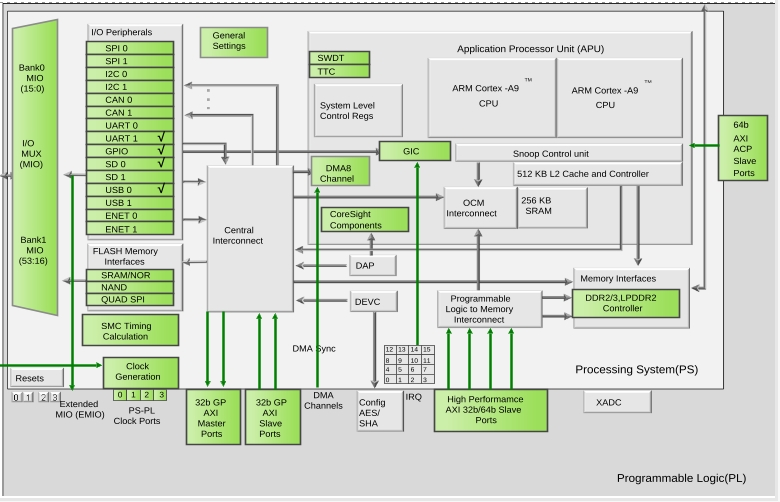

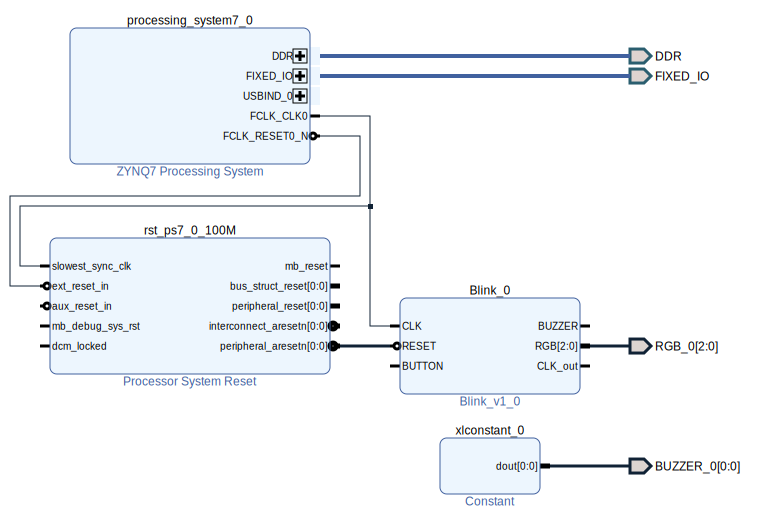

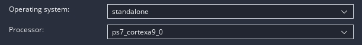

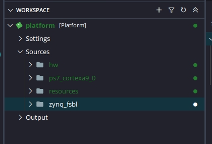

---

## Let's add a "Hellow World" application. (Not a "Linux Hellow World")!
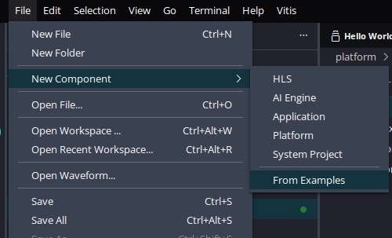

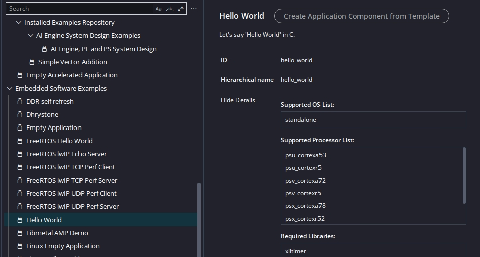

---

## Pins:

### ~~CAN: MIO{14,15}~~

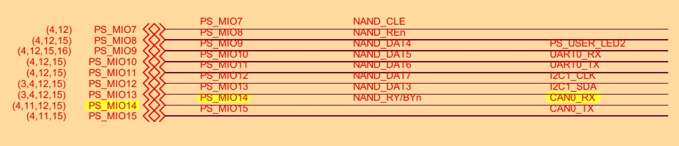

### Oops: CAN not be 😝!

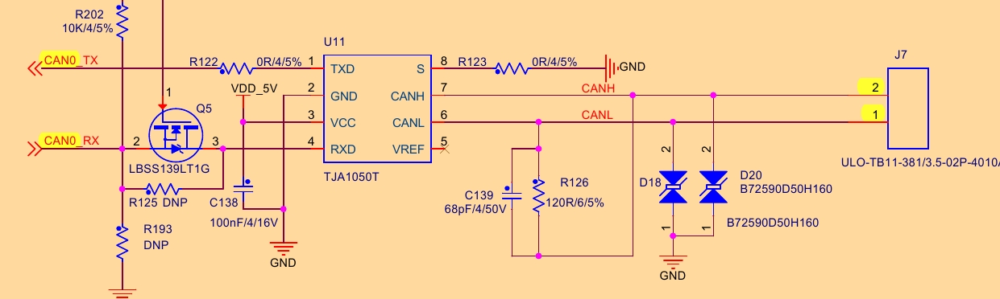

### LED: 1,2: MIO{0,9}

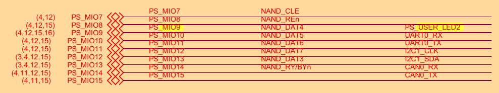

### Button: MIO{50}

---

## Releasing the pins:

## ~~Bound pins: CAN0~~

### Vivado:

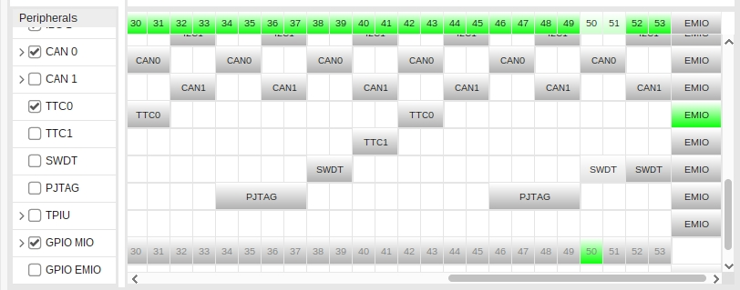

### ~~Releasing `CAN0`~~

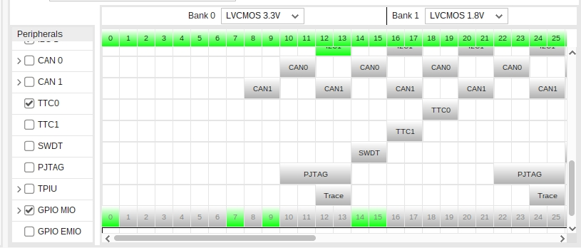

---

## [Identifying] USB/UART dependency:
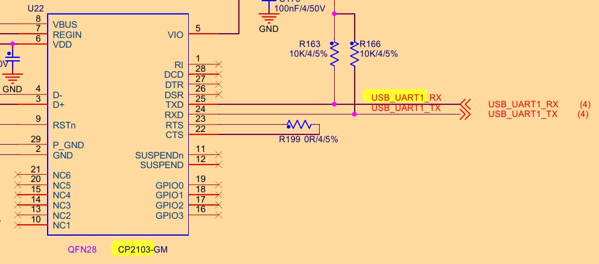

---

## Phase 2: [PS GPIO](GPIO.md)

---