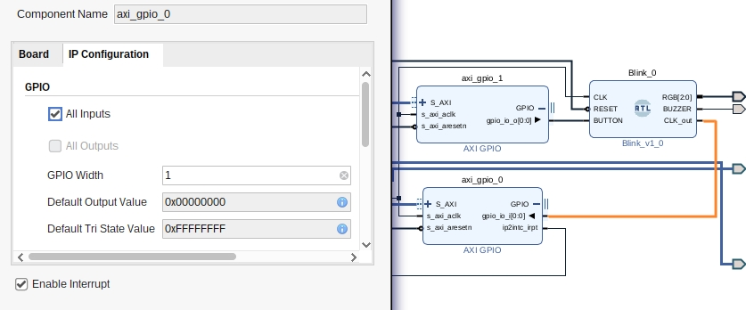
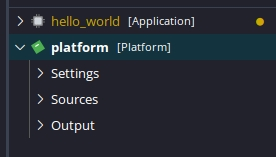

# Chapter 4

## PL&PS // synced(AXI) // interrupt

### Goal:

* Blink RGB(PL)
* Blink LED 1,2 (PS(CLK(PL)))
* Pause with Button(PS)
    * (Pause RGB(PL) with Button(PS))

---

### Our new [final] design


#### Changes:

* We're exporting CLK_out(1:100e6)
    * We'll need it to sync the LED1(PS) and LED2(PS)
* Importing Button(PS)
* The method is `AXI`. `AXI` helps communicate between PL and PS. Share ports/memory/etc..

#### Interrupts

* PS acts on Button(PS) and sends output to PL(AXI)
* PL calculates CLK_out(PL) and sends input to the PS(AXI)
* CLK_out syncs LED1(PS) and LED2(PS) by acting as an interrupt(IRQ)
    * IMPORTANT: I failed using an interrupt controller, and have, thus, fed, the interrupt, directly to IRQ(Zynq).
    * (I suppose, an interrupt controller is needed between AXI(CLK_out) and Zynq(IRQ)).
* Notes:
    * GPIO(axi_gpio_#) naming is important. The ID, helps choose the GPIO(I/O) in the PS.





")

#### Notes:

* Buttons, usually use [w:pull-up](https://en.wikipedia.org/wiki/Pull-up_resistor) resistors, thus act inverted. I.e. active buttons' value is `0` and inactive `1`. I suppose they're called "active low". They actually "ground" the (CPU)pin:


---

### Update code(Vitis) with new Design(Vivado):




---

### [Code(C++)](code)

* [[Code] Explanation](code.md)
* Vitis: For those interested, renaming `.c` to `.cpp` and using `extern "C" {}` on `C` headers, seems to work (for now 😱).
* Instead of describing the code, i'll jump right to the next chapter, with the hopes of using an `AXI Interrupt Controller` [successfully].
* I suppose, it's not needed. (Proceeding with next chapters).

---

### Code(VHDL)

```vhdl
library IEEE;
use IEEE.STD_LOGIC_1164.all;
use IEEE.NUMERIC_STD.all;       -- Operations: addition/..

-- ------------------------------------------ --
-- =                 Entity                 = --
-- ------------------------------------------ --
-- Description: Functions:
--      Blink PL(RGB).
--      Pause with PS(button).
--      PL(BUZZ) with PS(button).
--      Output CLK(downscaled) to blink PS(LED1/LED2).
-- (Downscaler method):
--      (Scale at around 1Hz).
--      Count up to CLK's frequency. Keep the MSbits.
-- -
entity Blink is
    Generic(
        N: natural := 27);  -- Primitive downscaling
    Port(
        CLK        : in  STD_LOGIC;
        RESET      : in  STD_LOGIC;
        BUTTON     : in  STD_LOGIC;
    	RGB        : out STD_LOGIC_VECTOR(2 downto 0);
    	BUZZER     : out STD_LOGIC;
    	CLK_out    : out STD_LOGIC);
end Blink;

-- ------------------------------------------------ --
-- =                 Architecture                 = --
-- ------------------------------------------------ --
architecture Behavioral of Blink is
    signal ticks: std_logic_vector(N - 1 downto 0) := (others => '0'); -- downscale to ~1b0Hz
begin
    -- Downscale: Count up to 2**N. Output around ~1Hz.
    -- -
    process (CLK, RESET, BUTTON)
        variable t: natural range 2**N - 1 downto 0 := 0;
    begin
        ticks <= std_logic_vector(to_unsigned(t, N));
        if rising_edge(CLK) then
            -- Pause on BUTTON(0) (pressed).
            -- (Buttons use pull-up (?)). [Thus, their values are inverted]..
            -- (Let's [just] say they are active low:).
            -- -
            if BUTTON = '1' then
                t := t + 1;
            else
                -- Pause [on active low].
                -- -
            end if;
        end if;
    end process;

    -- Blink around ~1Hz ±1Hz, utilizing MSBs.
    -- -
    RGB     <= ticks(N - 1 downto N - 3);
    BUZZER  <= not BUTTON;
    CLK_out <= ticks(N - 1);
end Behavioral;
```

---

## References:

* [Porting embeddedsw components to system device tree (SDT) based flow](https://xilinx-wiki.atlassian.net/wiki/spaces/A/pages/2743468485/Porting+embeddedsw+components+to+system+device+tree+SDT+based+flow)
* [ZYNQ for beginners: programming and connecting the PS and PL | Part 1](https://youtu.be/_odNhKOZjEo) (*youtube*)
* [ZYNQ for beginners: programming and connecting the PS and PL | Part 2](https://youtu.be/AOy5l36DroY) (*youtube*)
* [AXI gpio standalone driver](https://github.com/Xilinx/embeddedsw/tree/master/XilinxProcessorIPLib/drivers/gpio) (*github*)
* [Baremetal Drivers and Libraries](https://xilinx-wiki.atlassian.net/wiki/spaces/A/pages/18841745/Baremetal+Drivers+and+Libraries) (*wiki*)
* [examples](https://github.com/Xilinx/embeddedsw/tree/master/XilinxProcessorIPLib/drivers/gpio/examples) (*github*)
* gpio [API](https://xilinx.github.io/embeddedsw.github.io/gpio/doc/html/api/group__gpio.html) (*API*)
* Error: [Can't find xgpio.h](https://support.xilinx.com/s/question/0D52E00006hpTGBSA2/cant-find-xgpioh-xtmrctrh?language=en_US) (*Xilinx*)
* [`XGpioPs_IntrClear()` examples](https://cpp.hotexamples.com/examples/-/-/XGpioPs_IntrClear/cpp-xgpiops_intrclear-function-examples.html)
* Offtopic: [IRQs](https://youtu.be/luD2y81pD8s) (*youtube*)
* [Interrupts AXI GPIO and AXI Timer ECE 699: Lecture 5](https://people-ece.vse.gmu.edu/coursewebpages/ECE/ECE699_SW_HW/S16/viewgraphs/ECE699_lecture_5.pdf) (*pdf*)
* [GIC vs AXI Interrupt Controller](https://community.element14.com/technologies/fpga-group/f/forum/50536/gic-vs-axi-interrupt-controller/195430) (*forum*)

---