## Blink all [possible].
## Phase 1 [Vivado]

# FIXME: Create project with "Project is an extensible Vitis platform (?)"

Accessible to the PL:

* Buzzer
* RGB

Limited to the PS:

* LED1/2
* ~~CAN~~
* Button

Lets blink, the available ones, around 1Hz +- 1.

---

## Code:

```vhdl
library IEEE;
use IEEE.STD_LOGIC_1164.all;
use IEEE.NUMERIC_STD.all;       -- Operations: addition/..

-- ------------------------------------------ --
-- =                 Entity                 = --
-- ------------------------------------------ --
-- Description: Functions:
--      Blink RGB and buzzer
-- Downscaler:
--      Count up to CLK's frequency. Keep the MSbits.
-- -
entity Blink is
    Generic(
        N: natural := 27);  -- Primitive downscaling
    Port(
        CLK        : in  STD_LOGIC;
        RESET      : in  STD_LOGIC;
        --
    	BUZZER     : out STD_LOGIC;
    	RGB        : out STD_LOGIC_VECTOR(2 downto 0));
end Blink;

-- ------------------------------------------------ --
-- =                 Architecture                 = --
-- ------------------------------------------------ --
architecture Behavioral of Blink is
    signal state    : std_logic_vector(N - 1 downto 0) := (others => '0');    -- downscale to 1b0Hz
begin
    -- Downscale: Count up to 2**N, close to CLK's frequency.
    -- -
    process (CLK, RESET)
        variable v: natural range 2**N - 1 downto 0 := 0;
    begin
        state <= std_logic_vector(to_unsigned(v, N));
        if rising_edge(CLK) then
--            if RESET = '1' then         -- Reset
--                v := 0;
--            else
                  v := v + 1;
--            end if;
        end if;
    end process;

    -- Blink around 1Hz +- 1, by following the MSB - 1 bit.
    -- -
    RGB     <= state(N - 1 downto N - 3);
    BUZZER  <= state(N - 2);

end Behavioral;
```

---

## Procedure:

### Outline:

* Create a VHDL code
* Create a block design
    * Add Zynq
        * Let it automate: Blocks
        * Remove: Secondary_clock/AXI_interfaces/I2C/etc
            * IMPORTANT: Leave SD card support ON! This way, VHDL will be transferred to the PL. (CONFIRMED).
        * Create Wrapper
        * Set default clock (after wrapper). (Open "Platform Setup").
    * Add VHDL code as module
        * Let it automate: Connections
    * Make Buzzer & RGB external (will link them to pins later)
* Save block design
* Open "Elaborated Design" in order to set RGB and Buzzer pins.
* "Generate Bitstream"
* Export Platform: "Include Bitstream"
* Phase 2: Open Vitis

### Steps

#### Add Zynq
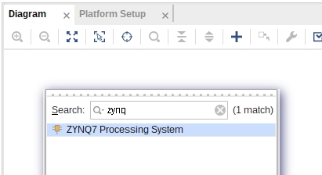

#### Block automation
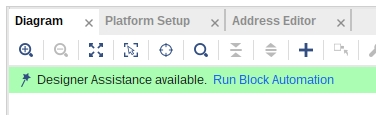

#### Remove extraneous (optional). IMPORTANT: Leave `SD` enabled (used for transfer of VHDL to the PL).
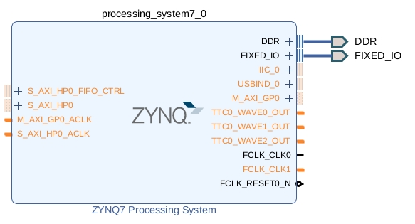

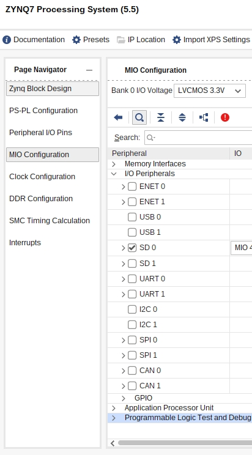

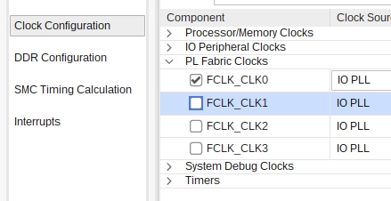

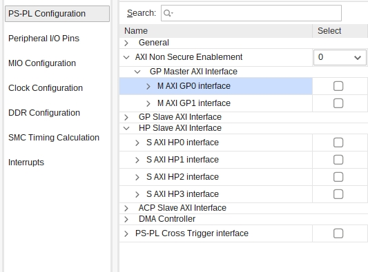

#### Create wrapper
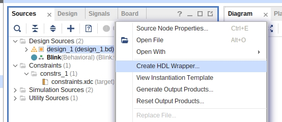

#### Set default CLK (after wrapper (in order to set "reset"))
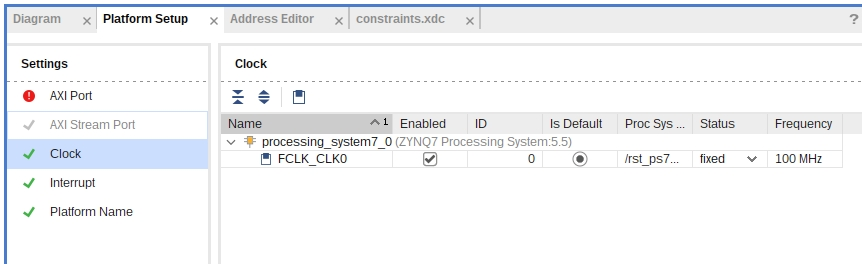

#### Add module (VHDL)
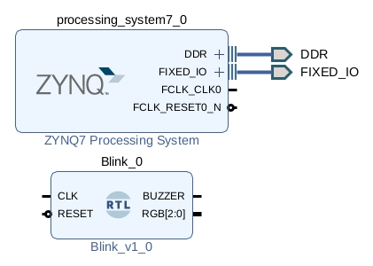

#### Automate
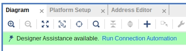

#### Make ports(pins) external
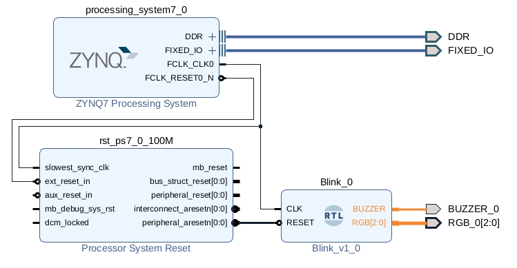

#### Save block design --

#### Set pins through "Open Elaborated Design"
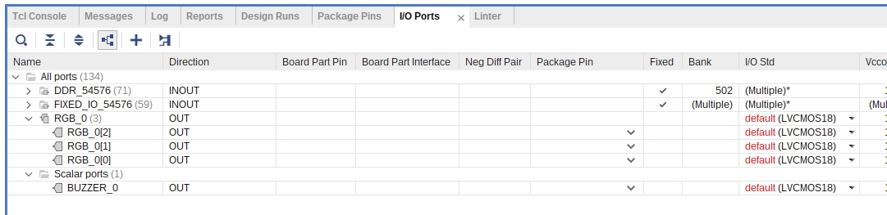

#### Find the corresponding pins in the schematic

* RGB:
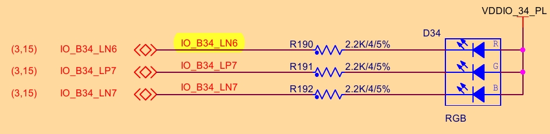

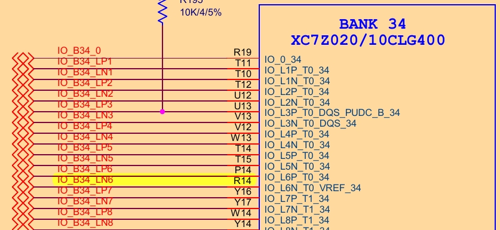

* Buzzer:
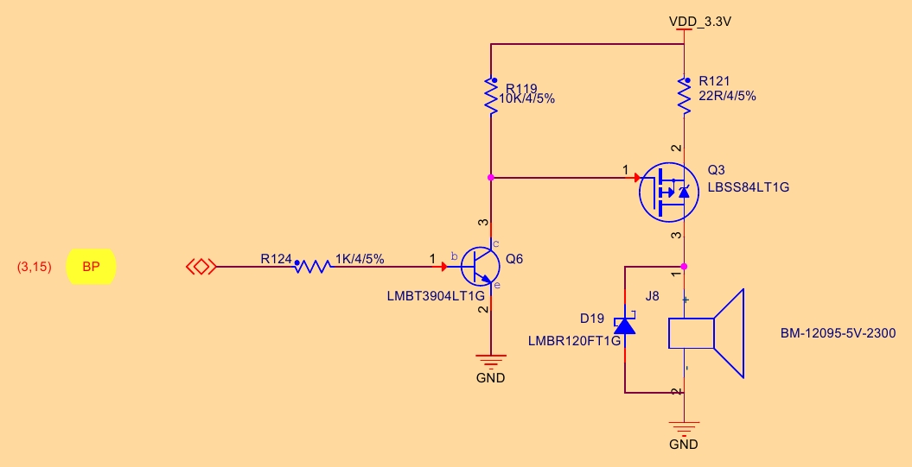

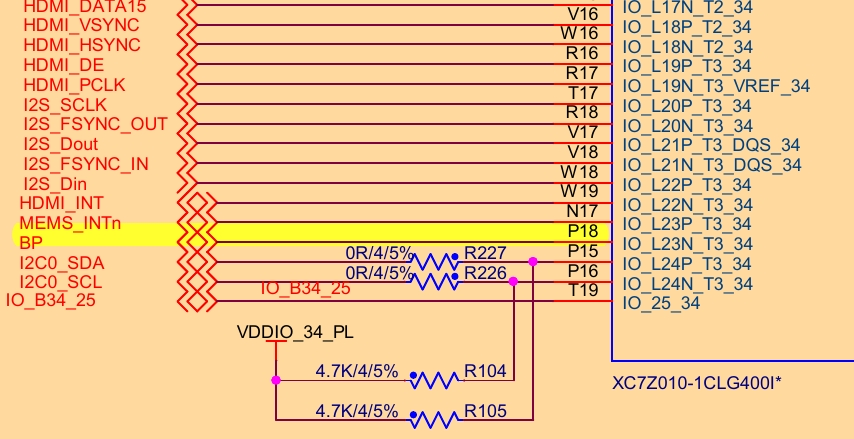

#### Save changes: Will create `constraints.xdc` file.
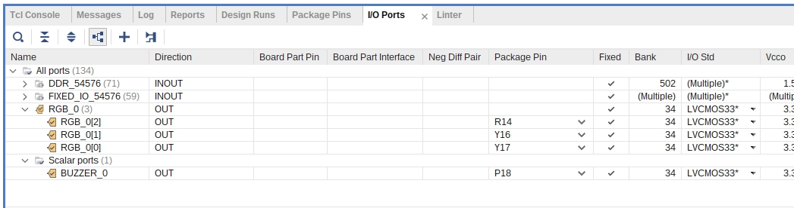

#### Generate bitstream --

#### Export hardware (or platform): IMPORTANT: "Include Bitstream"
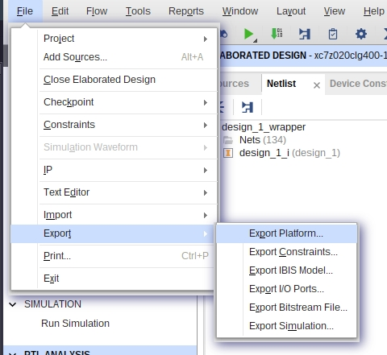

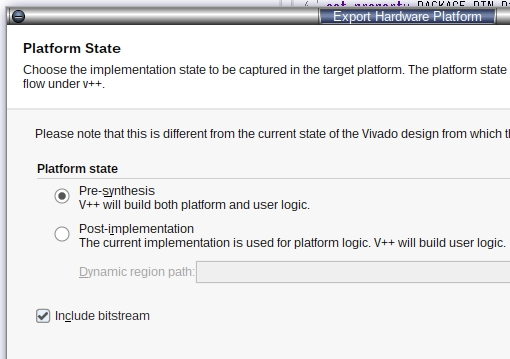

### Final [state]
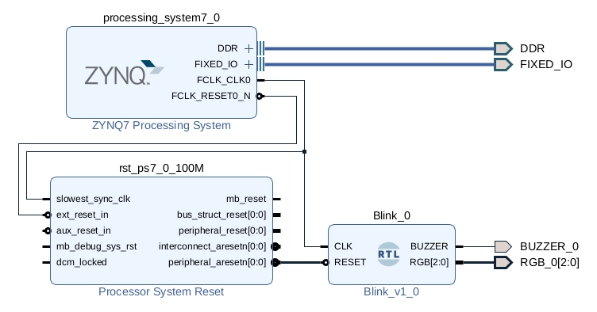


---

## TODO: Second method: Export bitsream and use Vitis:Template:FSBL

---

## Phase 2: [Open Vitis](Vitis.md)

---